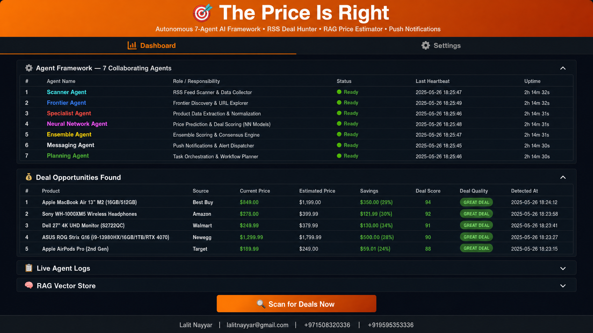
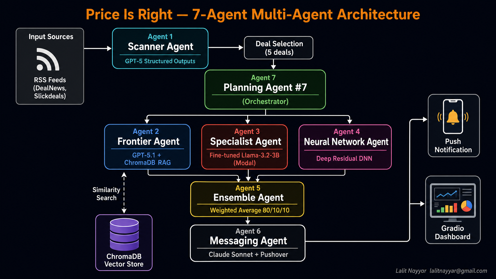
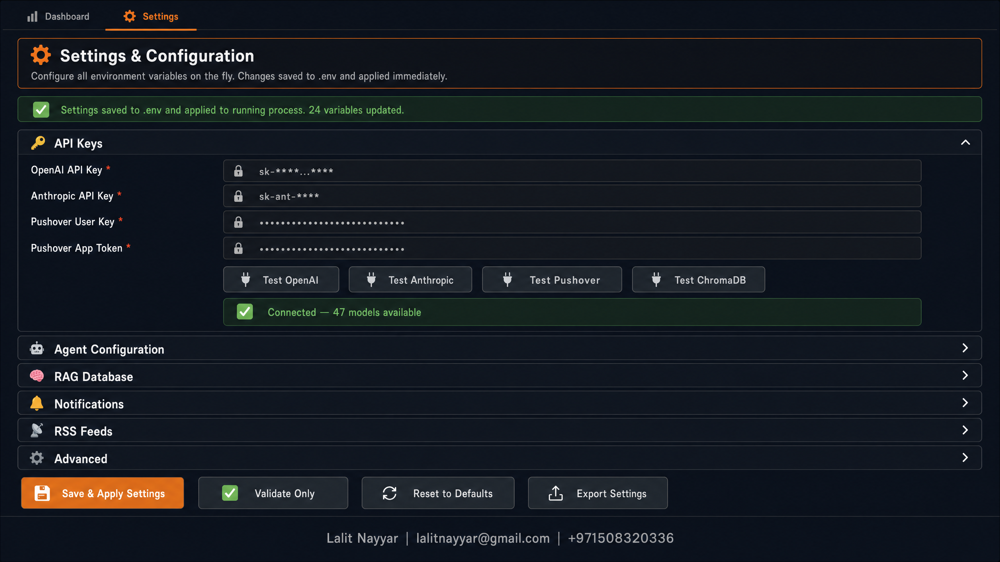
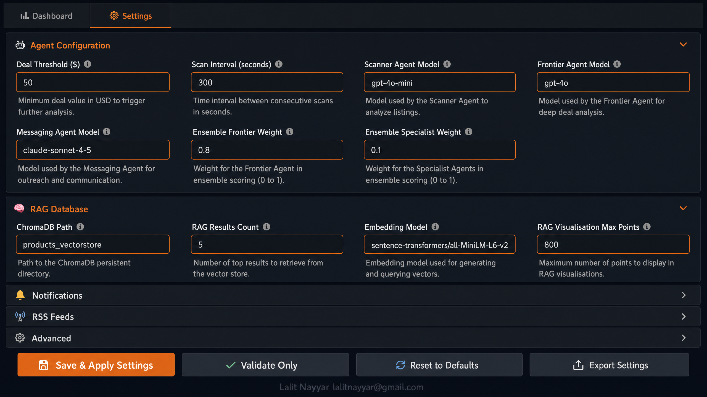
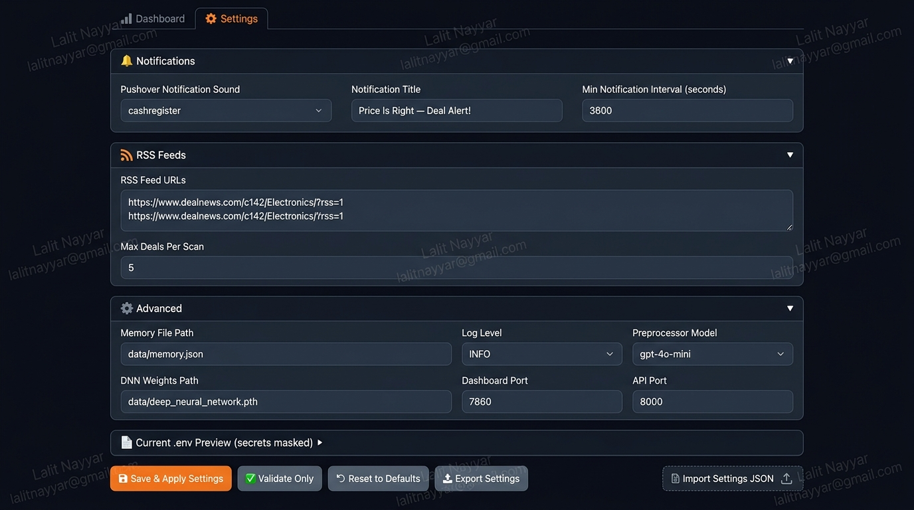
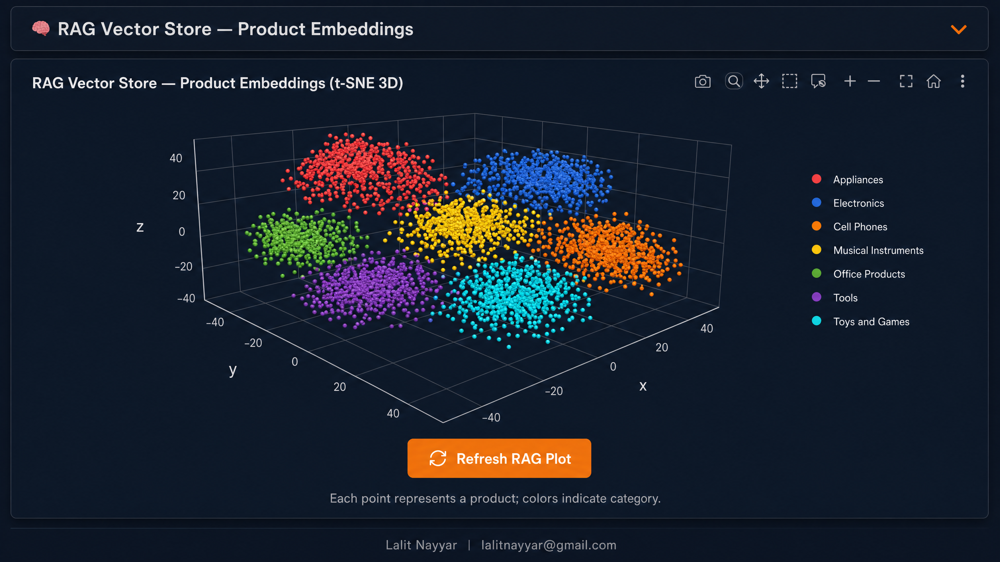
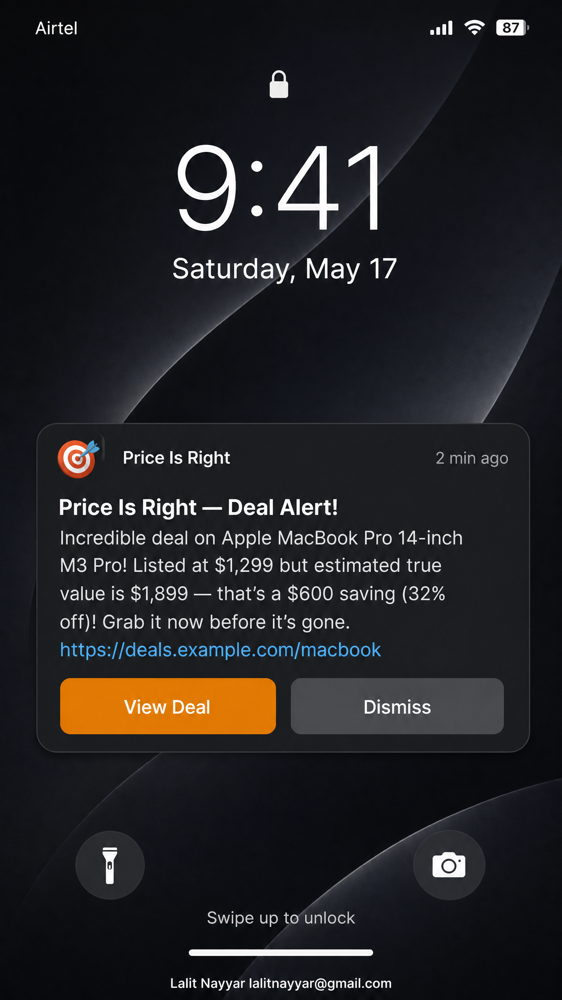
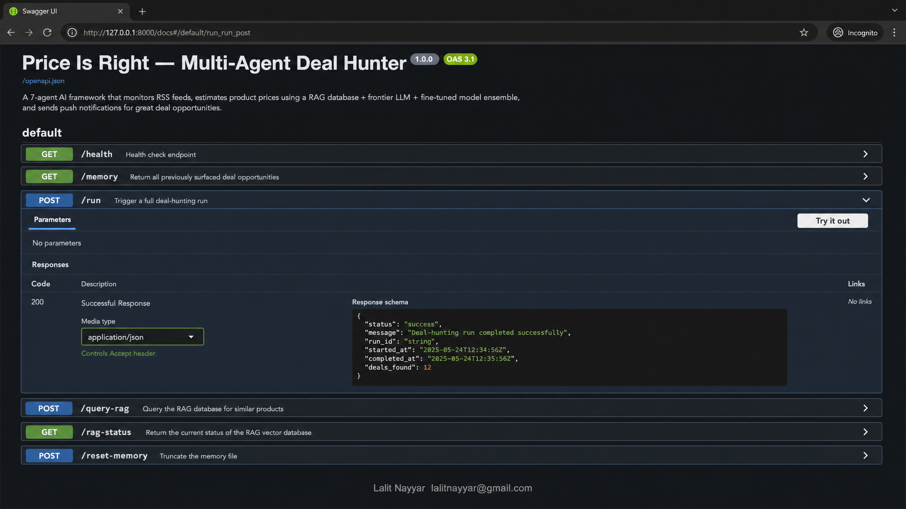
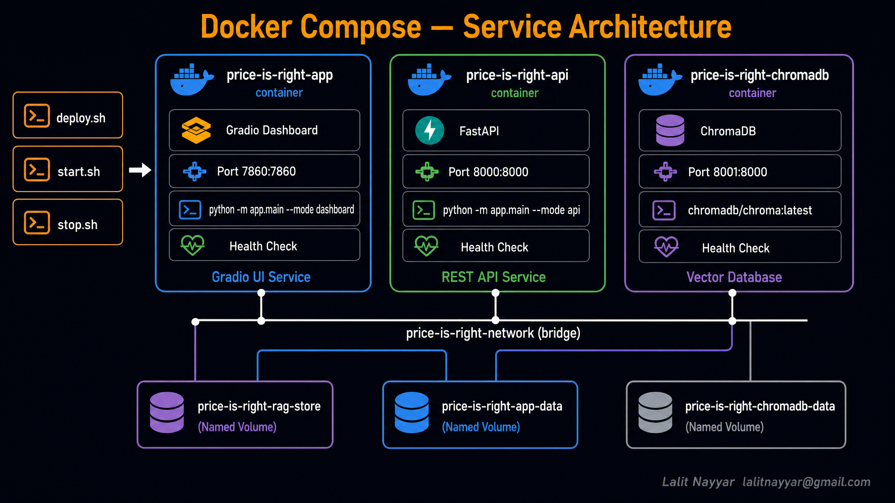

# 🎯 The Price Is Right — Multi-Agent Deal Hunter



> A modular, Docker-based application powered by a **7-agent AI framework** that autonomously hunts for online deals, estimates true product values using RAG and fine-tuned models, and delivers push notifications for the best opportunities — all configurable on the fly through a built-in Settings UI.

[](https://python.org)
[](https://docker.com)
[](https://gradio.app)
[](https://fastapi.tiangolo.com)
[](https://trychroma.com)
[](LICENSE)

---

## 📋 Table of Contents

1. [Architecture Overview](#-architecture-overview)
2. [Key Features & Functionality](#-key-features--functionality)
   - [Live Settings & Configuration Manager](#1-live-settings--configuration-manager)
   - [Folding View Dashboard](#2-folding-view-dashboard)
   - [3D RAG Vector Store Visualisation](#3-3d-rag-vector-store-visualisation)
   - [Automated Push Notifications](#4-automated-push-notifications)
   - [Comprehensive REST API](#5-comprehensive-rest-api)
   - [Robust Docker Deployment](#6-robust-docker-deployment)
3. [User Guide](#-user-guide)
   - [Prerequisites](#prerequisites)
   - [Setup & Configuration](#1-setup--configuration)
   - [Pre-Deployment Diagnostics](#2-pre-deployment-diagnostics)
   - [First-Time Deployment](#3-first-time-deployment)
   - [Accessing the Application](#4-accessing-the-application)
   - [Managing Settings via UI](#5-managing-settings-via-ui)
   - [Managing the Services](#6-managing-the-services)
   - [Pulling Latest Code & Updating](#7-pulling-latest-code--updating)
4. [Script Reference](#-script-reference)
5. [Docker Fixes & Known Issues Resolved](#-docker-fixes--known-issues-resolved)
   - [Fix 1: COPY data/ build failure](#fix-1----copy-data-build-failure)
   - [Fix 2: Obsolete version key warning](#fix-2----obsolete-version-39-warning)
   - [Fix 3: start.sh failing on fresh clone](#fix-3----startsh-failing-on-fresh-clone)
   - [Fix 4: ChromaDB permanently unhealthy](#fix-4----chromadb-container-permanently-unhealthy-blocks-app--api-from-starting)
6. [Project Structure](#-project-structure)
7. [Environment Variables Reference](#-environment-variables-reference)
8. [Disclaimer](#-disclaimer)

---

## 🌟 Architecture Overview

The system is built around a collaborative 7-agent framework. Each agent has a specific responsibility, working together in a pipeline to identify, evaluate, and notify you about great deals.



### The 7 Agents

| # | Agent | Model / Technology | Role & Responsibility |
|---|-------|--------------------|-----------------------|
| 1 | **Scanner Agent** | GPT-5 (gpt-5-mini) + Structured Outputs | Monitors RSS feeds (DealNews, Slickdeals) and uses structured outputs to extract the 5 most promising deals with clear prices and descriptions. |
| 2 | **Frontier Agent** | GPT-5.1 + ChromaDB RAG | Embeds product descriptions and queries a massive ChromaDB vector store for similar products, using GPT-5.1 to estimate prices based on retrieved context. |
| 3 | **Specialist Agent** | Fine-tuned Llama-3.2-3B (Modal GPU) | A "frontier-busting" specialist agent deployed on Modal GPU infrastructure with a PEFT adapter for highly accurate, domain-specific price estimation. |
| 4 | **Neural Network Agent** | Deep Residual DNN (PyTorch) | A local deep residual neural network that provides fast, offline price regression directly from text features — no API calls required. |
| 5 | **Ensemble Agent** | Weighted Combiner (80/10/10) | Orchestrates the Frontier, Specialist, and Neural Network agents, weighting their outputs to produce a highly accurate combined price estimate. |
| 6 | **Messaging Agent** | Claude Sonnet + Pushover API | Uses Anthropic's Claude Sonnet to craft engaging 2–3 sentence push notifications and delivers them directly to your phone via the Pushover API. |
| 7 | **Planning Agent** | GPT-5.1 Orchestrator | The top-level controller that manages the full workflow, evaluates the final discount against a configured threshold (e.g., $50), and triggers notifications. |

---

## 🚀 Key Features & Functionality

### 1. Live Settings & Configuration Manager



A dedicated **⚙️ Settings** tab in the dashboard allows you to manage all 24 environment variables on the fly — without touching the `.env` file or restarting the application. The Settings page is organised into 6 collapsible accordion sections:

| Section | What You Can Configure |
|---------|------------------------|
| **🔑 API Keys** | OpenAI, Anthropic, Pushover User Key & Token, Modal Token ID & Secret |
| **🤖 Agent Configuration** | Deal threshold ($), scan interval, model names for each agent, ensemble weights |
| **🧠 RAG Database** | ChromaDB path, results count (top-k), embedding model, visualisation max points |
| **🔔 Notifications** | Pushover sound, notification title, minimum notification interval |
| **📡 RSS Feeds** | Feed URLs (one per line), max deals per scan |
| **⚙️ Advanced** | Memory file path, log level, preprocessor model, DNN weights path, port numbers |

**Key capabilities:**

- **Connection Test buttons** — verify OpenAI, Anthropic, Pushover, and ChromaDB credentials instantly without saving.
- **💾 Save & Apply** — writes changes to `.env` and applies keys/thresholds to the running process immediately (no restart needed).
- **✅ Validate Only** — check all fields for correctness without persisting anything.
- **🔄 Reset to Defaults** — restore all fields to their out-of-box values.
- **📤 Export Settings** — download a JSON backup with all secrets automatically redacted.
- **📥 Import Settings** — upload a previously exported JSON to restore a configuration.
- **📄 .env Preview** — view the current `.env` file with all secrets masked.



*Agent Configuration section (top) and RAG Database section (bottom) — both expanded with live editable fields.*



*Notifications, RSS Feeds, and Advanced sections — showing Pushover sound, feed URLs textarea, log level dropdown, and port configuration.*

---

### 2. Folding View Dashboard

The main **📊 Dashboard** tab provides a sleek, interactive Gradio UI with four collapsible accordion sections:

- **⚙️ Agent Framework — 7 Collaborating Agents**: Real-time status table showing each agent's name, role, status indicator (Ready / Running / Error), last heartbeat timestamp, and uptime.
- **💰 Deal Opportunities Found**: A data table of identified deals showing product name, source retailer, current price, estimated true value, savings amount and percentage, deal score (0–100), and a GREAT DEAL badge for top opportunities. Click any row to re-send its push notification.
- **📋 Live Agent Logs**: Real-time streaming log output with ANSI-to-HTML colour rendering so you can watch all 7 agents think and collaborate in real time.
- **🧠 RAG Vector Store**: Interactive 3D t-SNE scatter plot of the ChromaDB product embedding space (see section 3 below).

A prominent **🔍 Scan for Deals Now** button triggers an immediate full pipeline run across all 7 agents.

---

### 3. 3D RAG Vector Store Visualisation



Explore the AI's "memory" with an interactive 3D t-SNE scatter plot of the ChromaDB product embedding space. Products are clustered by category (Electronics, Appliances, Computers, etc.), showing exactly how the Frontier Agent finds semantically similar items for price comparison. Hover over any point to see the product name and its estimated price.

---

### 4. Automated Push Notifications



When the Planning Agent identifies a deal where the discount exceeds your configured threshold, the Messaging Agent uses **Claude Sonnet** to write a compelling, human-sounding alert and pushes it instantly to your smartphone via the **Pushover API**. The notification includes the product name, current price, estimated true value, and the saving amount.

---

### 5. Comprehensive REST API



A full **FastAPI** backend provides programmatic access to the entire pipeline. All endpoints are documented via the built-in Swagger UI at `http://localhost:8000/docs`.

| Endpoint | Method | Description |
|----------|--------|-------------|
| `/health` | GET | Service health check |
| `/run` | POST | Trigger a full 7-agent pipeline scan |
| `/deals` | GET | Retrieve the latest identified deal opportunities |
| `/rag/query` | POST | Query the RAG vector store directly |
| `/rag/stats` | GET | ChromaDB collection statistics |
| `/settings` | GET / POST | Read or update application settings programmatically |

---

### 6. Robust Docker Deployment



Fully containerised architecture using **Docker Compose**, separating the Gradio UI, FastAPI backend, and ChromaDB vector store into isolated, scalable services with three persistent named volumes:

| Service | Container | Port | Description |
|---------|-----------|------|-------------|
| `app` | `price-is-right-app` | 7860 | Gradio dashboard + Settings UI |
| `api` | `price-is-right-api` | 8000 | FastAPI REST API |
| `chromadb` | `price-is-right-chromadb` | 8001 | ChromaDB vector database |
| `rag-init` | *(one-shot)* | — | Populates the vector store on first deploy |

---

## 📖 User Guide

### Prerequisites

Before you begin, ensure you have the following installed and available:

- **Docker** (v24+) and **Docker Compose** (v2+ plugin — `docker compose`, not `docker-compose`)
- **Git** (for cloning and using `update.sh`)
- **OpenAI API Key** — for the Scanner Agent (GPT-5-mini) and Frontier Agent (GPT-5.1)
- **Anthropic API Key** — for the Messaging Agent (Claude Sonnet)
- **Pushover Account** — a free account at [pushover.net](https://pushover.net) gives you a User Key; create an Application to get a Token
- *(Optional)* **Modal Account** — for the fine-tuned Specialist Agent GPU inference

---

### 1. Setup & Configuration

Clone the repository and create your local environment file:

```bash
git clone https://github.com/lalitnayyar/priceisrightcapstone.git
cd priceisrightcapstone
cp .env.example .env
```

Open `.env` in your editor and fill in your API keys. At minimum, set `OPENAI_API_KEY`. All other keys can be left blank and configured later via the **Settings UI**.

```bash
# Minimum required
OPENAI_API_KEY=sk-...

# Recommended for full functionality
ANTHROPIC_API_KEY=sk-ant-...
PUSHOVER_USER=your_pushover_user_key
PUSHOVER_TOKEN=your_pushover_app_token
```

> **Tip:** You can leave all keys blank and enter them through the ⚙️ Settings tab after the app starts. The Settings page has built-in connection test buttons to verify each key before saving.

---

### 2. Pre-Deployment Diagnostics

Run the built-in diagnostic script to validate your environment before deploying. It performs a comprehensive PASS / FAIL / WARN check across 5 categories: environment variables, file structure, Python syntax, Docker configuration, and data files.

```bash
./scripts/diagnose.sh
```

A clean run looks like:

```
============================================================
  Price Is Right — Diagnostic Report
============================================================
[1] Environment Configuration
  [PASS] .env file exists
  [WARN] OPENAI_API_KEY not set — Scanner and Frontier agents will be disabled
...
[5] Data and Model Files
  [WARN] data/ directory missing (will be created on first run)
  [WARN] products_vectorstore/ not found — run deploy.sh to initialise

  Total checks: 32  |  PASS: 28  |  FAIL: 0  |  WARN: 4
  ✓ System is ready to deploy!
```

---

### 3. First-Time Deployment

Deploy the entire stack with a single command. This builds the Docker images, creates the `data/` and `products_vectorstore/` directories, starts all services, and initialises the RAG database with sample product data.

```bash
./scripts/deploy.sh
```

Options:

```bash
./scripts/deploy.sh --no-cache       # Force a full image rebuild (no Docker layer cache)
./scripts/deploy.sh --skip-rag-init  # Skip the RAG database initialisation step
```

The deploy script runs **5 steps** in sequence:

| Step | Action |
|------|--------|
| 1 | Validate `.env` — auto-copies from `.env.example` if missing |
| 2 | Create `data/` and `products_vectorstore/` directories on the host |
| 3 | `docker compose build` — builds the application image |
| 4 | Start ChromaDB, wait for health check, then start `app` and `api` |
| 5 | Run the `rag-init` one-shot container to populate the vector store |

---

### 4. Accessing the Application

Once deployed, open your browser to:

| Service | URL |
|---------|-----|
| **Dashboard & Settings** | [http://localhost:7860](http://localhost:7860) |
| **API Server** | [http://localhost:8000](http://localhost:8000) |
| **API Documentation** | [http://localhost:8000/docs](http://localhost:8000/docs) |
| **ChromaDB Admin** | [http://localhost:8001/api/v1](http://localhost:8001/api/v1) |

---

### 5. Managing Settings via UI

The Settings page allows you to configure every aspect of the application without editing files or restarting containers:

1. Open the Dashboard at `http://localhost:7860`.
2. Click the **⚙️ Settings** tab at the top.
3. Expand the **🔑 API Keys** section and enter your OpenAI, Anthropic, and Pushover credentials.
4. Click the **Test** button next to each key to verify the connection — a green success message confirms it works.
5. Expand **🤖 Agent Configuration** and set your **Deal Threshold** (the minimum saving in USD that triggers a push notification).
6. Expand **📡 RSS Feeds** to add or remove deal feed URLs (one per line).
7. Click **💾 Save & Apply Settings** — changes are written to `.env` and applied to the live process instantly.

To back up your configuration before making changes, click **📤 Export Settings** — this downloads a JSON file with all secrets redacted.

---

### 6. Managing the Services

Use the provided scripts for day-to-day service management:

```bash
# Start all services (builds images if not already built)
./scripts/start.sh

# Start without rebuilding (faster, uses existing images)
./scripts/start.sh --no-build

# Start a specific service only
./scripts/start.sh app

# Stop all running containers
./scripts/stop.sh

# Stop and remove all persistent volumes (full reset — WARNING: deletes all data)
./scripts/stop.sh --remove-volumes

# View live logs from all services
docker compose logs -f

# View logs from a specific service
docker compose logs -f app
docker compose logs -f api
```

---

### 7. Pulling Latest Code & Updating

Use `update.sh` to pull the latest code from GitHub and redeploy with **zero downtime** — ChromaDB keeps running throughout so your vector store data is never lost.

```bash
# Standard update: pull main branch + rebuild + rolling restart
./scripts/update.sh

# Full options
./scripts/update.sh --no-cache         # Force full image rebuild (no Docker layer cache)
./scripts/update.sh --branch develop   # Pull from a specific branch
./scripts/update.sh --skip-rag-init    # Skip RAG re-initialisation (faster)
./scripts/update.sh --hard-reset       # Discard local changes before pulling
./scripts/update.sh --help             # Show all options
```

The update script runs **6 steps**:

| Step | Action |
|------|--------|
| 1 | Stash local changes (or `--hard-reset` to discard), then `git pull origin <branch>` |
| 2 | Print a diff of changed files between the old and new commit |
| 3 | Create `data/` and `products_vectorstore/` directories if missing |
| 4 | `docker compose build` — rebuild images with the new code |
| 5 | Rolling restart — restarts `app` and `api` only; `chromadb` stays running |
| 6 | HTTP health checks on Dashboard `:7860`, API `:8000`, and ChromaDB `:8001` |

---

## 📜 Script Reference

| Script | Purpose | Key Options |
|--------|---------|-------------|
| `scripts/deploy.sh` | First-time full deployment | `--no-cache`, `--skip-rag-init` |
| `scripts/start.sh` | Start (and build) containers | `[service]`, `--no-build` |
| `scripts/stop.sh` | Stop containers | `--remove-volumes` |
| `scripts/update.sh` | Pull latest code & redeploy | `--no-cache`, `--branch`, `--skip-rag-init`, `--hard-reset` |
| `scripts/diagnose.sh` | Pre-flight environment check | *(no options)* |

---

## 🔧 Docker Fixes & Known Issues Resolved

This section documents the specific Docker errors that were identified and fixed in the codebase.

### Fix 1 — `COPY data/ ./data/` Build Failure

**Error:** `failed to compute cache key: "/data": not found`

**Root cause:** The `data/` directory does not exist in the repository (it is generated at runtime), so Docker had nothing to copy and the build failed immediately.

**Resolution:** The `COPY data/ ./data/` line was removed from the `Dockerfile`. Instead, the directories are now created inside the image at build time using `RUN mkdir -p /app/data /app/products_vectorstore /app/logs`. At runtime, Docker named volumes are mounted over these paths, so all persistent data is preserved across container restarts.

### Fix 2 — Obsolete `version: "3.9"` Warning

**Error:** `WARN: the attribute 'version' is obsolete, it will be ignored`

**Root cause:** Docker Compose v2+ ignores the `version` key entirely and emits a warning on every single command, cluttering output.

**Resolution:** The `version: "3.9"` line was removed from `docker-compose.yml`. No functional change — Docker Compose v2 does not require it.

### Fix 3 — `start.sh` Failing on Fresh Clone

**Error:** `pull access denied for price-is-right, repository does not exist`

**Root cause:** `docker compose up -d` without `--build` tries to pull a pre-existing image named `price-is-right:latest` from Docker Hub, which does not exist. On a fresh clone, the image must be built locally first.

**Resolution:** `start.sh` now runs `docker compose up -d --build`, which always builds the image locally before starting containers. A `--no-build` flag is provided for subsequent starts where rebuilding is not needed (saving time).

### Fix 4 — ChromaDB Container Permanently Unhealthy (blocks app & api from starting)

**Error:**
```
✘ Container price-is-right-chromadb  Error  dependency chromadb failed to start
dependency failed to start: container price-is-right-chromadb is unhealthy
```

**Root cause:** The `chromadb/chroma` Docker image does **not** include `curl`. The original healthcheck used:
```yaml
test: ["CMD", "curl", "-f", "http://localhost:8000/api/v1/heartbeat"]
```
Because `curl` is not present in the image, every health probe exited with `executable file not found in $PATH`. After exhausting all retries (5 × 30 s = 150 s), Docker marked the container as **unhealthy**, which prevented the `app` and `api` services from starting due to their `depends_on: condition: service_healthy` constraint.

**Resolution — three changes applied:**

1. **Healthcheck command** — switched from `CMD curl` to `CMD-SHELL wget`, which *is* available in the chroma image:
   ```yaml
   healthcheck:
     test: ["CMD-SHELL", "wget -qO- http://localhost:8000/api/v1/heartbeat || exit 1"]
     interval: 15s
     timeout: 10s
     retries: 10
     start_period: 60s
   ```

2. **Image pinned** — changed `chromadb/chroma:latest` to `chromadb/chroma:0.5.20` for reproducibility. The `latest` tag can silently introduce breaking API changes.

3. **deploy.sh probe** — the inline bash wait loop in `deploy.sh` also used `curl` inside the container. Fixed to use `wget` consistently:
   ```bash
   docker compose exec chromadb wget -qO- http://localhost:8000/api/v1/heartbeat
   ```

> **Note:** `curl` is correctly used in the `app` and `api` healthchecks because those containers are built from `python:3.11-slim` which has `curl` installed via the `Dockerfile`.

---

## 📁 Project Structure

```text
priceisrightcapstone/
├── app/
│   ├── agents/
│   │   ├── agent.py                  # Base Agent class
│   │   ├── scanner_agent.py          # Agent 1 — RSS feed scanner (GPT-5-mini)
│   │   ├── frontier_agent.py         # Agent 2 — RAG price estimator (GPT-5.1)
│   │   ├── specialist_agent.py       # Agent 3 — Fine-tuned LLM (Modal GPU)
│   │   ├── neural_network_agent.py   # Agent 4 — Deep Residual DNN (PyTorch)
│   │   ├── ensemble_agent.py         # Agent 5 — Weighted price combiner
│   │   ├── messaging_agent.py        # Agent 6 — Claude + Pushover notifications
│   │   ├── planning_agent.py         # Agent 7 — Workflow orchestrator
│   │   └── autonomous_planning_agent.py  # LLM-driven tool-calling variant
│   ├── core/
│   │   ├── deals.py                  # Deal data models + RSS ingestion
│   │   ├── preprocessor.py           # Text cleaning and feature extraction
│   │   ├── deal_agent_framework.py   # Main framework orchestration class
│   │   └── rag_db.py                 # ChromaDB initialisation and querying
│   ├── models/
│   │   └── deep_neural_network.py    # PyTorch deep residual network definition
│   ├── ui/
│   │   ├── dashboard.py              # Gradio tabbed UI (Dashboard + Settings tabs)
│   │   └── settings_page.py          # Live Settings page with 6 accordion sections
│   ├── utils/
│   │   └── log_utils.py              # ANSI-to-HTML log formatter
│   ├── api.py                        # FastAPI REST API (6 endpoints)
│   └── main.py                       # Application entry point (--mode flag)
├── assets/                           # Documentation screenshots and diagrams
│   ├── screenshot_tabbed_overview.png
│   ├── screenshot_settings_api_keys.png
│   ├── screenshot_settings_agent_config.png
│   ├── screenshot_settings_advanced.png
│   ├── screenshot_rag_plot.png
│   ├── screenshot_push_notification.png
│   ├── screenshot_api_docs.png
│   ├── docker_services.png
│   └── architecture_diagram.png
├── data/                             # Runtime: memory.json, DNN weights (gitignored)
├── products_vectorstore/             # Runtime: ChromaDB persistent storage (gitignored)
├── scripts/
│   ├── deploy.sh                     # First-time full deployment
│   ├── start.sh                      # Start (and build) containers
│   ├── stop.sh                       # Stop containers
│   ├── update.sh                     # Pull latest code + rolling redeploy
│   └── diagnose.sh                   # Pre-flight environment diagnostic
├── docker-compose.yml                # Docker Compose service definitions
├── Dockerfile                        # Application container build definition
├── requirements.txt                  # Python dependencies
├── .env.example                      # Environment variable template
└── README.md                         # This file
```

---

## 🔐 Environment Variables Reference

All variables are configured in `.env` (copy from `.env.example`) or via the **⚙️ Settings** tab in the UI.

| Variable | Required | Default | Description |
|----------|----------|---------|-------------|
| `OPENAI_API_KEY` | **Yes** | — | OpenAI API key (Scanner + Frontier agents) |
| `ANTHROPIC_API_KEY` | Recommended | — | Anthropic API key (Messaging Agent) |
| `PUSHOVER_USER` | Recommended | — | Pushover User Key (from pushover.net) |
| `PUSHOVER_TOKEN` | Recommended | — | Pushover Application Token |
| `MODAL_TOKEN_ID` | Optional | — | Modal Token ID (Specialist Agent) |
| `MODAL_TOKEN_SECRET` | Optional | — | Modal Token Secret |
| `DEAL_THRESHOLD` | No | `50` | Minimum saving ($) to trigger a notification |
| `SCAN_INTERVAL` | No | `300` | Seconds between automatic scan cycles |
| `SCANNER_MODEL` | No | `gpt-4o-mini` | Model for the Scanner Agent |
| `FRONTIER_MODEL` | No | `gpt-4o` | Model for the Frontier Agent |
| `MESSAGING_MODEL` | No | `claude-sonnet-4-5` | Model for the Messaging Agent |
| `CHROMA_DB_PATH` | No | `products_vectorstore` | Path to ChromaDB persistence directory |
| `RAG_RESULTS_COUNT` | No | `5` | Number of similar products to retrieve from RAG |
| `DASHBOARD_PORT` | No | `7860` | Port for the Gradio dashboard |
| `API_PORT` | No | `8000` | Port for the FastAPI server |

---

## 📝 Disclaimer

**Author**: Lalit Nayyar
**Email**: [lalitnayyar@gmail.com](mailto:lalitnayyar@gmail.com)
**Phone**: +971508320336 / +919595353336
**GitHub**: [https://github.com/lalitnayyar/priceisrightcapstone](https://github.com/lalitnayyar/priceisrightcapstone)

*This project is a capstone demonstration of multi-agent LLM orchestration, RAG integration, fine-tuned model deployment, and Docker-based production architecture.*
